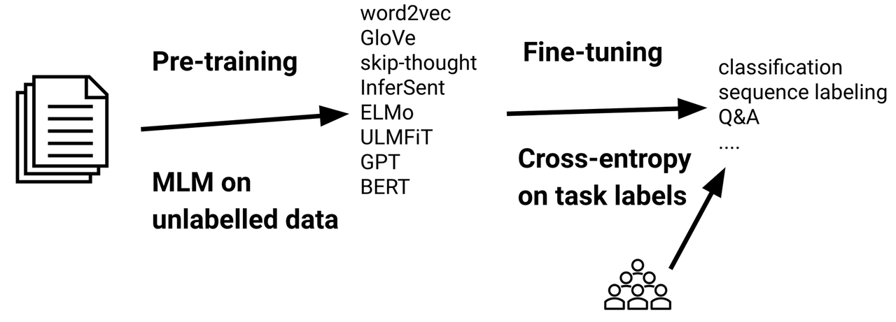
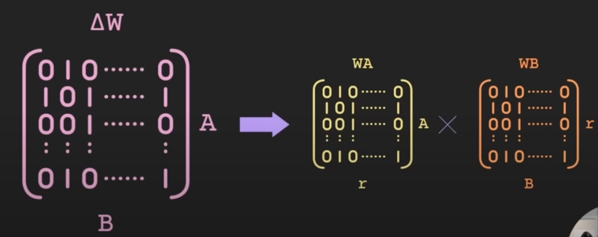
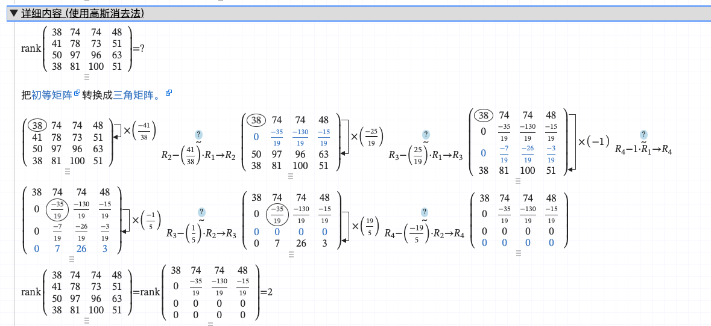
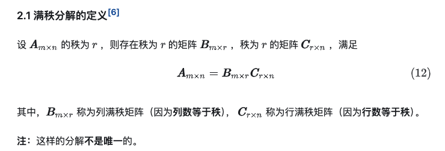
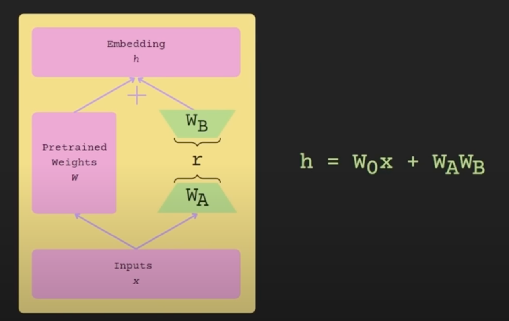
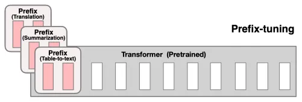
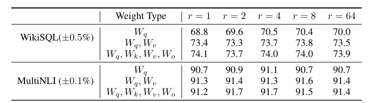

## LoRA是什么
现如今的大语言模型（LLM）动辄几十至几百亿参数，从头开始训练一个可用的大模型一般需要大量数据、机器、时间，这种训练规模对于一个非超大型规模的团队来说是难以承受的
```azure
以GPT-4为例，据说其使用了约25000个A100的GPU，训练了90~100天，所使用的数据集包含了13万亿个token（大约百T级别的数据）
```
故一般LLM模型训练的一般范式是使用别人训好的足够强大的预训练模型+自己的领域任务数据集进行微调。

微调本质上就是使用领域任务数据集对模型进行第二次训练，让模型更适配我们想让他做的事情。
一种比较直接的微调思路是全参数微调（FFT），即直接使用领域任务数据集对整个模型进行训练，更新整个模型的全部参数以让其更加适配任务。
但FFT由于需要调整整个大模型的参数，故其会带来训练时间长、训练数据需求量大、训练占用显存大的问题
随着模型越来越大，FFT变得更加困难。
```azure
对于一个7B的模型，FFT所需的显存为160GB，这显然是难以接受的。
```
于是就要求我们需要使用参数高效微调（PEFT）的方法，这类方法的核心是只调整模型的部分参数以达到接近FFT的效果。
这么做的好处是降低训练成本（时长，数据量需求，训练显存占用），但如何在降低训练成本的前提下逼近FFT的性能就是各种PEFT方法需要解决的问题。
而LoRA便是一种PEFT的方法，它基于低秩假设给出了一个降低训练参数量的微调方法。

## LoRA原理
大模型微调的整个过程可以看作是对每一个矩阵参数而言，训练一个新的矩阵，然后将这个矩阵加到原始的模型里：

受这个思路启发，我们可以在微调阶段冻结所有原始模型的参数，然后在每个矩阵参数旁加上一个同等大小的空矩阵，只训练这个新增的矩阵：

LoRA主张在微调的过程中新增的矩阵内在维度低，故可以构造两个较小的矩阵来表示它。


## 低秩假设
复习一下矩阵的秩。通俗的理解就是，一个矩阵进行初等变换后得到的矩阵中，非全零的行的数量即为矩阵的秩。
以下图为例，该矩阵的秩为2。

上面的矩阵的秩为2就可以理解为，构成这个矩阵的行里线性不相关的行数就只有两行，其他行都可以由这两行进行线性变化得到。
```azure
列同理，但行秩等于列秩，在此不做展开
```
这个结论可以比较简单粗暴地理解为：这个矩阵只有两行是有信息的（能够表达信息的）。
于是可以较粗暴地推广结论：当一个矩阵的秩越低，其所能包含的信息量就越少。
而LoRA的低秩假设便是：针对单一任务进行全参数微调后得到的增量矩阵△W包含的信息很少，可以近似为一个内在维度很低的矩阵（等同于低秩矩阵）。

在[LoRA引用的基础论文](https://arxiv.org/pdf/2012.13255)里提到一个实验，对RoBERTa（125M参数量）仅需要优化200个参数，就可以使其在语义相似任务上达到全参数微调的90%性能。这个实验侧面证明在仅针对单一任务的情况下，影响该任务效果的参数量很低。也就是对应的增量矩阵十分稀疏。
故可以根据此假设反推方法：当仅需要针对某一任务微调的情况下，只需要一个十分稀疏的增量矩阵就可以达到逼近全参数微调的效果。这个矩阵显然是低秩的（内在维度低）。
而一个低秩的矩阵可以通过满秩分解分成两个较小的矩阵：

于是我们就可以尽可能压缩微调模型所需的参数量：


## 效果对比
* 性能对比：LoRA在各项任务上可以跟全参数微调持平：

* 显存对比：LoRA训练时占用的显存为FFT的1/8~1/5。

  | 方法 | 7B | 13B | 30B | 65B |
  |-------|-------|-------|-------|-------|
  | FFT | 160GB | 320GB | 600GB | 1200GB |
  | LoRA | 20GB | 40GB | 120GB | 240GB |

##  LoRA vs 其他PEFT方法
除了LoRA之外，业界也有其他的PEFT方法，这里简单介绍其他两个方法
### Adapter
Adapter的思路是在模型中间插入可训练的模块，而在微调的时候冻结预训练模型原有的参数，而只训练新加入的参数：
    
### Prefix Tuning
Prefix Tuning的思路是在输入端做手脚，在输入的前面加几个特殊的token，并在微调时只训练跟这几个token有关的参数：


这两个方法与LoRA的对比如下：

| 方法 | 训练时显存占用 | 训练难度 | 推理速度 |
  |-------|-----|-------|-------|
  | LoRA | 中   | 低 | 正常 | 
  | Adapter | 中   | 中 | 较高 |
  | Prefix Tuning | ?   | 高 | 较高 |

## LoRA使用
### LoRA训练
实际使用LoRA时，需要在开始微调前做几个设置：
1. 决定哪些矩阵需要额外引入LoRA层
2. 初始化LoRA层的参数
3. 设置LoRA层的超参数：rank和alpha（和一些通用的LLM超参数，如epoch、学习率、dropout）
### 引入LoRA的层
一般情况下，不是越多层引入LoRA效果越好的，部分对效果影响较小的层引入LoRA对整体效果提升帮助不大，反而会占用额外的训练资源。
对于Transformers结构而言，一般只会在QKVO层加LoRA，对于Linear层则不会加。
甚至在部分场景下（医学影像分割）有论文指出只需要在QV层加上LoRA效果反而更好：


### LoRA值初始化
对每个LoRA层，$W_A$正常高斯初始化，$W_B$置为0
高斯初始化的作用是让矩阵A有着满足高斯分布的非零初始值，以避开对称权重的问题，参考：[神经网络入门篇:详解随机初始化(Random+Initialization) - Oten - 博客园](https://www.cnblogs.com/oten/p/17861213.html)
在此基础上讨论两个矩阵的另外的初始化方案：
1. A，B全部初始化为零：这会导致所有可训练的网络全部都是0初始值，一样会引入对称权重问题
2. A，B全部高斯初始化：这会导致模型第一步输出跟不加LoRA层的输出相差过多（因为A*B不再是零），会导致模型难以收敛
### LoRA Rank
LoRA Rank $r$为$W_A$和$W_B$的宽度，直接决定了$W_A$与$W_B$相乘的矩阵的最大的秩。
一般而言，随着LoRA的Rank增大：
- 微调的时耗会逐渐增加
- 模型效果会先增长再下降，最后再增长直到逼近FFT的效果
  - 按照先前的假设来解释，下降是因为参数的更新大多在低秩空间内；如果使用更高秩的矩阵的话，相当于允许对高维空间进行更新，反而可能会导致额外的非必要参数变化(引入了噪声)。
  - 极端情况甚至是从r=1开始就下降了
  
论文中实验了多个不同的rank，验证了上述结论（GPT-3模型）：

### LoRA Alpha
LoRA Alpha决定了最终的△W在推理时的缩放倍数，倍数计算=$\alpha/rank$
一般来说让$\alpha=rank$或者让$\alpha=2*rank$即可，这里借用QLoRA在Llama2-7B下的实验，发现缩放倍数在0.5~2之间的效果是较好的：

### LoRA推理部署
得益于LoRA的外挂矩阵设计，在推理前只需要把LoRA矩阵加和到原始预训练模型里就可以直接使用了。
此时LoRA层已经直接加到原始模型里，不会再引入额外的推理步骤。
而其他PEFT方法都或多或少会引入额外的推理成本（Adapter引入额外的层，Prefix Tuning引入额外的Token）
