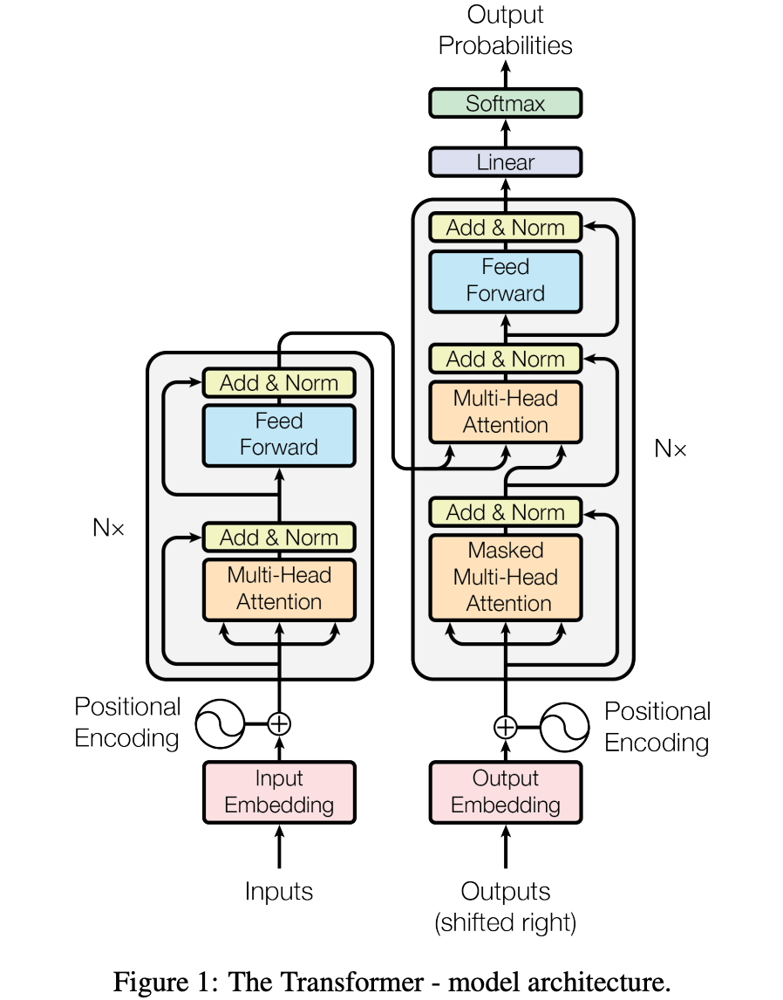
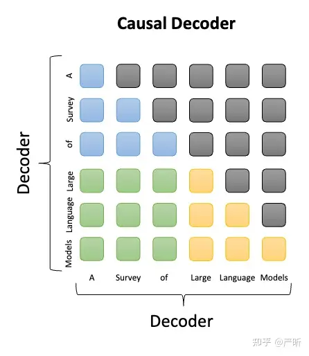
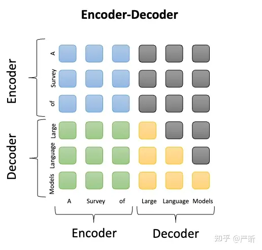
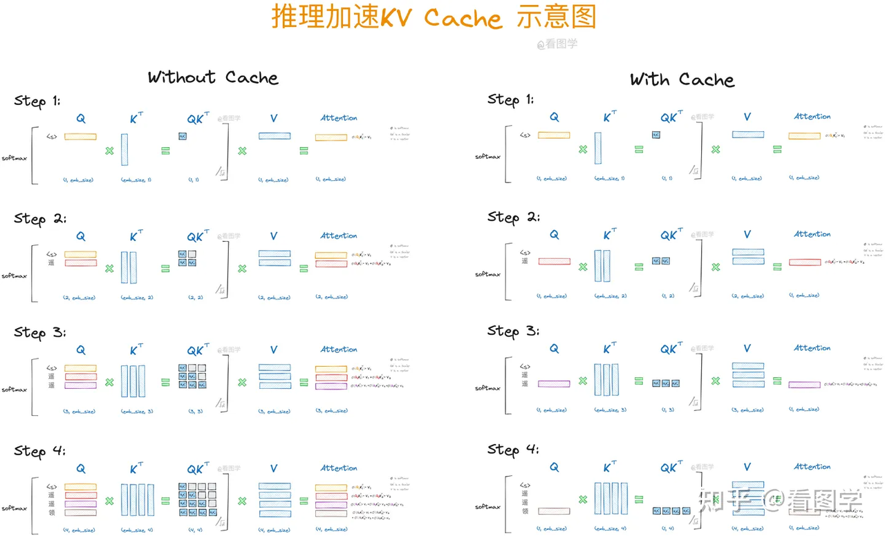
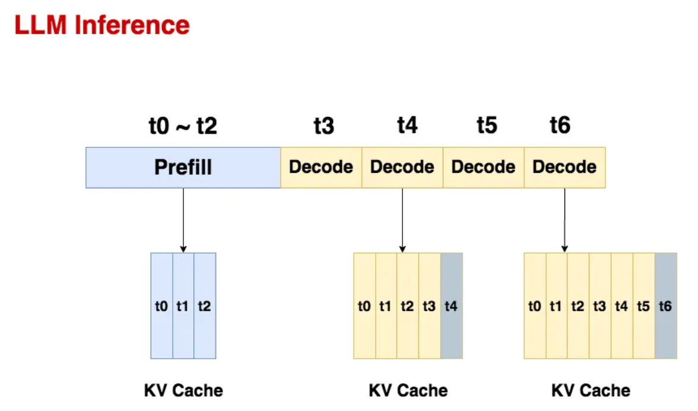

## 一、 QKV 


$Attention(Q,K,V)=softmax(\frac{QK^T}{\sqrt{d_k}})V$

## LLM的几种架构
### Causal Decoder
Causal Decoder架构的典型代表就是GPT系列模型，使用的是单向注意力掩码，以确保每个输入token只能注意到过去的token和它本身，输入和输出的token通过Decoder以相同的方式进行处理。在下图中，灰色代表对应的两个token互相之间看不到，否则就代表可以看到。例如，”Survery”可以看到前面的“A”，但是看不到后面的“of”。Causal Decoder的sequence mask矩阵是一种典型的下三角矩阵。


### Encoder-Decoder
Transformer最初被提出来的时候采用的就是Encoder-Decoder架构，模型包含两部分Encoder和Decoder，两部分参数独立。其中Encoder将输入序列处理为一种中间表示，而Decoder则基于中间表示自回归地生成目标序列，典型的LLM是Flan-T5。Encoder部分采用双向注意力，对应的prompt的每个token都可以互相看到；而Decoder部分仍然采用单向注意力，对应的completion仍然保证前面的token看不到后面的token：


### Prefix Decoder
Prefix Decoder架构也被称为non-causal Decoder架构，它的注意力机制和Encoder-Decoder很接近，也是输入部分采用双向注意力，而输出部分采用单向注意力；和Encoder-Decoder不同的是，处理输入和输出的模型参数是完全共享的，从这一点看，它又和Causal Decoder比较接近，都属于Decoder-Only架构，第一代的 GLM 属于这类架构：


KV Cache是Transformer标配的推理加速功能，transformer官方use_cache这个参数默认是True，但是它只能用于Causal Decoder架构的模型，这是因为Causal Decoder有Causal Mask，在推理的时候前面已经生成的字符不需要与后面的字符产生attention，从而使得前面已经计算的K和V可以缓存起来。

## KV Cache
以一个例子对比使用/不使用 KV Cache的推理过程。假设模型最终生成“遥遥领先”4个字。
* 当模型生成第一个“遥”字时，input="\<s>","\<s>"是起始字符。Attention的计算如下：
  $Att_1(Q,K,V) = softmax(Q_1K^T_1)V_1$

* 当模型生成第二个“遥”字时，input="\<s>遥", Attention的计算如下：
  $$Att_2(Q,K,V)=softmax(\begin{bmatrix}Q_1K^T_1 & -\infty \\ Q_2K^T_1 & Q_2K^T_2\end{bmatrix})\begin{bmatrix}V_1 \\ V_2\end{bmatrix} = (\begin{bmatrix}softmax(Q_1K^T_1) \times V_1  \\ softmax(Q_2K^T_1) \times V_1 + softmax(Q_2K^T_2) \times V_2\end{bmatrix})$$
  你会发现，由于 $Q_1K^T2$ 这个值会mask掉，Q1在第二步参与的计算与第一步是一样的，而且 V1 参与计算Attention时也仅仅依赖于 Q1，与 Q2 毫无关系。
  V2 参与计算Attention时也仅仅依赖于 Q2，与 Q1 毫无关系。
  
* 当模型生成第三个“领”字时，input="\<s>遥遥"Attention的计算如下：
  $$Att_1(Q,K,V) = softmax(Q_1K^T_1)V_1$$
  $$Att_2(Q,K,V) = softmax(Q_2K^T_1) \times V_1 + softmax(Q_2K^T_2) \times V_2$$
  $$Att_3(Q,K,V) = softmax(Q_3K^T_1) \times V_1 + softmax(Q_3K^T_2) \times V_2 + softmax(Q_3K^T_3) \times V_3$$
   同样的 Attk 只与 Qk 有关，而与 V 无关。
* 当模型生成第四个“先”字时，input="\<s>遥遥领"Attention的计算如下：
  $$Att_1(Q,K,V) = softmax(Q_1K^T_1)V_1$$
  $$Att_2(Q,K,V) = softmax(Q_2K^T_1) \times V_1 + softmax(Q_2K^T_2) \times V_2$$
  $$Att_3(Q,K,V) = softmax(Q_3K^T_1) \times V_1 + softmax(Q_3K^T_2) \times V_2 + softmax(Q_3K^T_3) \times V_2$$
  $$Att_4(Q,K,V) = softmax(Q_4K^T_1) \times V_1 + softmax(Q_4K^T_2) \times V_2 + softmax(Q_4K^T_3) \times V_3 + softmax(Q_4K^T_4) \times V_4$$

看上面图和公式，我们可以得出结论：
1. 当前计算方式存在大量冗余计算。
2. $Att_k$ 只与 QK 有关。
3. 推理第 xk 个字符的时候只需要输入字符 xk-1 即可。
 我们每一步其实只需要根据 Qk 计算 Attk 就可以，之前已经计算的Attention完全不需要重新计算。但是 K 和 V 是全程参与计算的，所以这里我们需要把每一步的 K，V 缓存起来。

## 优缺点

* 速度快：比较有 KV Cache 和没有 KV Cache的情况下，GPT-2 生成 1000 个token的平均和标准偏差时间：
```azure
with KV caching: 11.885 +- 0.272 seconds
without KV caching: 56.197 +- 1.855 seconds
```
* 耗显存：当sequence特别长的时候，KV Cache 是个 Memory 刺客。

## 二、PD分离式推理
### 问题背景
Transformer LLM 推理过程分为两个阶段：prefill 和 decode。
- prefill 阶段：将用户输入的 prompts 生成 q、k、v，存入 KV Cache（为 decode 阶段缓存）。这一步计算并行好，是计算密集型 compute bound。
- decode 阶段：由最新产生的 tokens 生成 q、k、v，计算它与之前所有 tokens 的 attention，这一步需要从 KV Cache 中读取前面所有 token 的 key、value，因此是内存密集型 memory bound。

  在 long context 背景下，prefill 和 decode 阶段对计算和显存的需求非常不平衡，decode 阶段对 KV Cache 的容量需求是动态增长的、不能事先预测和分配（decode 阶段直到输出 end of sentence token 才停止）。如果把 prefill 和 decode 阶段混合部署，会造成 memory 等资源浪费，影响推理请求的吞吐量和延迟。因此，一种方法是将 prefill 和 decode 阶段分离，将 prefill 和 decode 部署在不同的 GPU 组。但是，prefill 和 decode 分离会带来新的问题：
  1. 如何细粒度地调度请求
  2. 请求从 prefill 到 decode 阶段可能需要迁移，迁移开销大
  3. GPU 组是静态划分的，无法跨组协同导致 memory 碎片
### 架构
推理系统的三板斧：batch，cache，schedule。

1. Cache
  MemPool管理推理集群中的所有内存，包括CPU DRAM和GPU HBM。
  - MemPool在每个推理实例中运行，共同提供一组分布式内存池API。它管理正在进行的请求使用的活动KV缓存和请求完成后保留的历史KV缓存。
  - 索引层将提示标记映射到历史KV缓存，确保高效检索缓存数据。
  - MemPool具有在实例之间交换数据的有效机制，减轻了推理引擎处理异构硬件的负担。
2. Schedule
   调度模块将来自外部服务的请求路由到底层推理实例，并以流式方式返回生成的响应。
  - 全局提示树。调度模块维护 Global Prompt 前缀树，分别用于Prefill、Decode实例，指向存储KV缓存的实例。
  - 调度。当请求到达Schedule时，它会经过以下步骤。首先，Schedule运行一个分词器，将提示字符串转换为token ID。其次，Schedule通过同时对所有类型的树调用match来查询全局提示树。第三，Schedule将查询结果与当前负载信息一起发送到策略模块。策略模块选择具有最长公共前缀（即保留的最大历史KV缓存）的实例。一旦选择了实例，Schedule就会检查是否存在存储所选实例中不存在的额外历史KV缓存的实例。如果是这样，策略引擎还会输出此类实例和相应token ID的列表。最后，Schedule 将请求和元数据发送到所选实例。当实例向调用者返回响应时，更新全局提示树。
3. Batching
   Batching 策略对两阶段的性能影响显著，但趋势相反：
  - Prefill 阶段：吞吐量随 batch size 增加逐渐趋于平稳。这是因为 Prefill 的计算受限特性（compute-bound），当 batch 中的总 token 数超过某个阈值时，计算资源成为瓶颈。
  - Decode 阶段：吞吐量随 batch size 增加显著提升。由于 Decode 阶段的存储受限特性（memory-bound），增大 batch size 可提高计算效率，从而显著增加吞吐量。

    下图展示了两阶段吞吐量随 batch size 变化的趋势：
  
